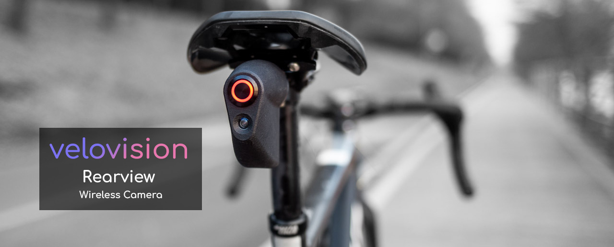

	

Velovision Rearview is an open-source, wireless camera for cycling AI applications.

<h3>

[Homepage](https://velovision.app) | [Documentation](https://rearview.velovision.app) ([Github](https://github.com/tensorturtle/velovision-rearview-docs))

</h3>

# To use Velovision Rearview

1. [Get your Velovision Rearview here](https://store.velovision.app)
2. Secure it onto your bike with the included mounting hardware.
3. [Download the App](https://apps.apple.com/us/app/velovision-rearview/id6475875460)

# To develop your own applications using Velovision Rearview

Follow the tutorial at [Velovision Rearview Docs](https://rearview.velovision.app)

Happy Riding and Developing!
